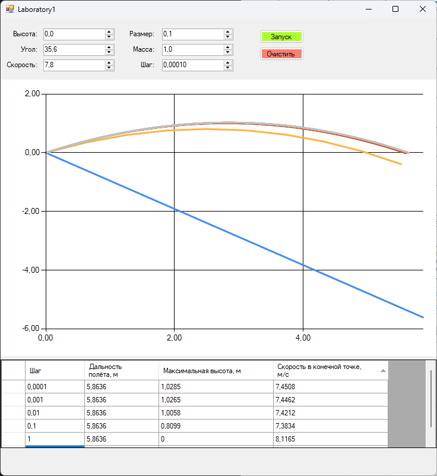

# Лаборатория 1 (Полет тела в атмосфере)

В процессе выполнения работы были реализованы следующие пункты:
- Консольное приложение
  
- Код программы
- Результаты программы в таблице
    | Шаг моделирования, с | 1 | 0.1 | 0.01 | 0.001 | 0.0001 |
    |----------------------|---|-----|------|-------|--------|
    | Дальность полёта, м | 5,8636  |   5,8636  |  5,8636    |    5,8636   |   5,8636     |
    | Максимальная высота, м | 0|0,8099 |1,0058 | 1,0265|1,0285 |
    | Скорость в конечной точке, м/с |8,1165 | 7,3834|7,4212 |7,4462 | 7,4508|

## Выводы
Исходя из результаов программы можно сделать несколько выводов.
- Во-первых, шаг размером 1 является не таким информативным, как 0,1 - 0,01.
- Во-вторых начиная с 0,001 - 0,0001 результаты моделирования координально не меняются.
- В-третьих, с уменьшением шага, время моделирования возрастает.

