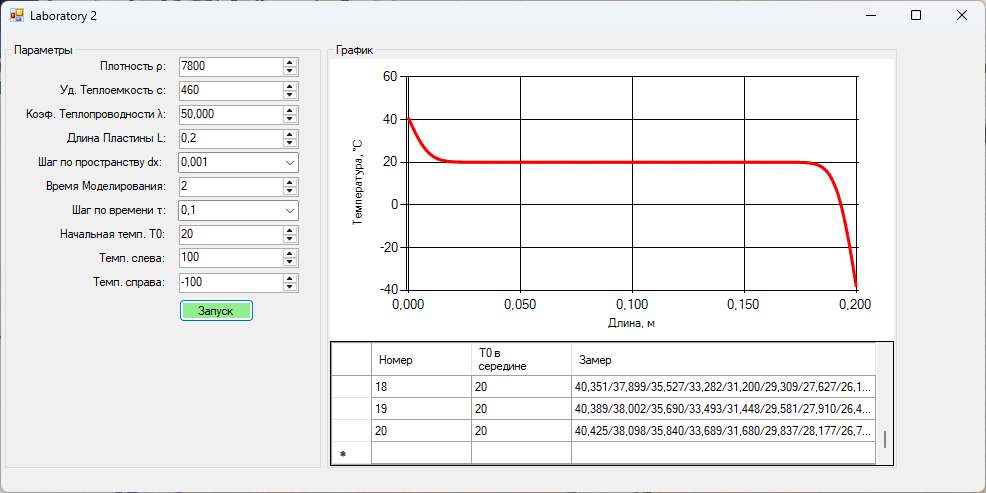

### Метод конечных разностей для уравнения теплопроводности

**Задание:**  
Реализовать моделирование изменения температуры в пластине на основе одномерного уравнения теплопроводности с использованием метода конечных разностей.

Выполнить моделирование с различными шагами по времени и по пространству.  
Заполнить таблицу значений температуры в центральной точке пластины после 2 секунд модельного времени.

# Лаборатория 2 (Распространение тепла в пластине)

В процессе выполнения работы были реализованы следующие пункты:
- Консольное приложение
  
- Код программы
- Результаты программы в таблице

| Шаг по времени, с \ Шаг по пространству, м | 0.1 | 0.01 | 0.001 | 0.0001 |
|-------------------------------------------|-----|------|-------|--------|
| 0.1 | 19,94456| 20|20 |20 |
| 0.01 |19,94457 |20 |20 | 20|
| 0.001 |19,94457 |20 | 20| 20|
| 0.0001 |19,94457 | 20| 20| 20|

