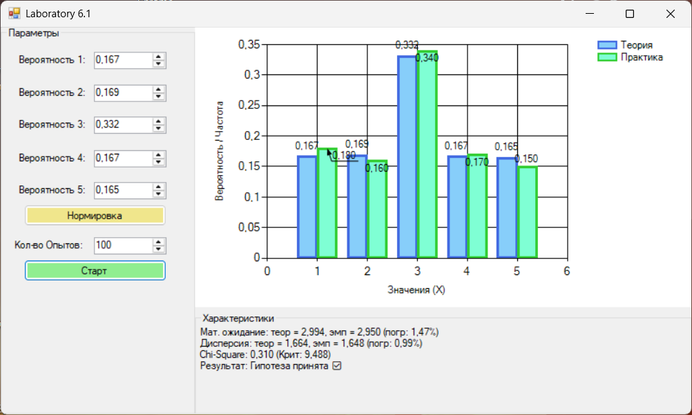
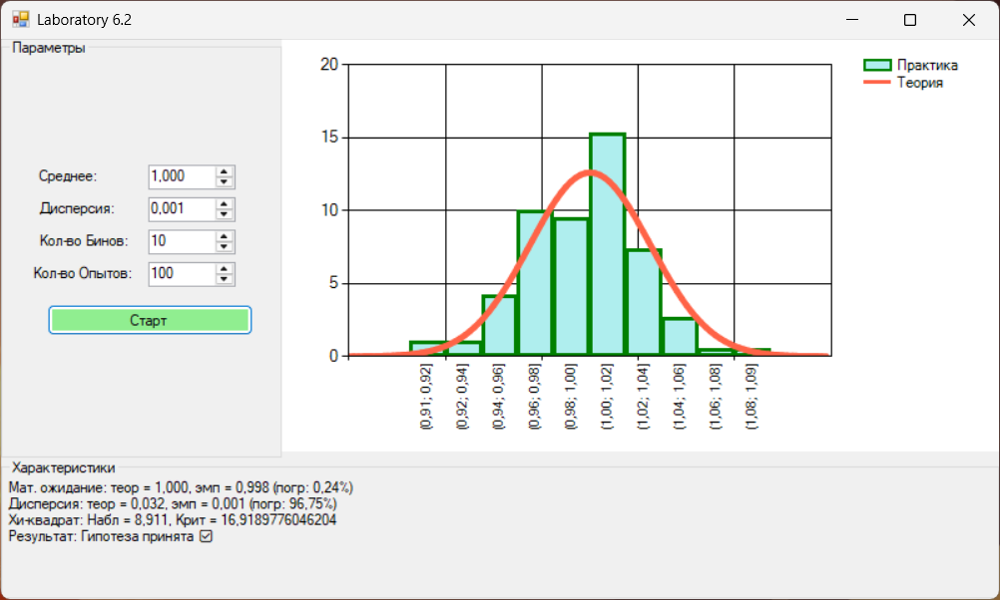

### Имитационное моделирование дискретных случайных величин (GUI)

**Задание:**
- реализовать генерацию дискретной случайной величины, заданной рядом распределения;
	- вычислить эмпирические вероятности;
	- вычислить выборочные среднее и дисперсию, их относительные погрешности;
	- вычислить статистику χ² и применить критерий χ² при:
	  - N = 10, 100, 1 000, 10 000;
- Реализовать генератор нормальной случайной величины, 
	- построить гистограммы 
	- сравнить точность моделирования при разных объёмах выборки.
- сделать вывод.

**Реализация**
- Для дискретной величины реализован комулятивный метод интервалов.
- Для нормальной величины применено преобразование на основе Центральной-Предельной Теоремы.
- Для обеих моделей вычисляются выборочные характеристики и статистика хи-квадрат; результаты выводятся в интерфейсе.

**Выводы:**
- *Лабораторная 6.1*
- Был реализована программа с графическим Интерфейсом:

- 

| Объем выборки ($N$) | $\chi^2$ набл. | $\chi^2$ крит. ($\alpha=0.05$) | Результат проверки |
| :--- | :---: | :---: | :--- |
| **10** | 1.962 | 9.488 | Гипотеза принята |
| **100** | 4.494 | 9.488 | Гипотеза принята |
| **1 000** | 1.569 | 9.488 | Гипотеза принята |
| **10 000** | 2.644 | 9.488 | Гипотеза принята |

- *Лабораторная 6.1*
- Был реализована программа с графическим Интерфейсом:

- 

| Объем выборки ($N$) | $\chi^2$ набл. | $\chi^2$ крит. ($\alpha=0.05$) | Результат проверки |
| :--- | :---: | :---: | :--- |
| **10** | 4.458 | 16.918 | Гипотеза принята |
| **100** | 9.891 | 16.918 | Гипотеза принята |
| **1 000** | 12.609 | 16.918 | Гипотеза принята |
| **10 000** | 14.635 | 16.918 | Гипотеза принята |

Приложение моделирует дискретные и нормальные случайные величины. При увеличении объёма выборки эмпирические вероятности, среднее и дисперсия стабилизируются и приближаются к теоретическим значениям, что подтверждает адекватность реализованных генераторов и расчётов.
