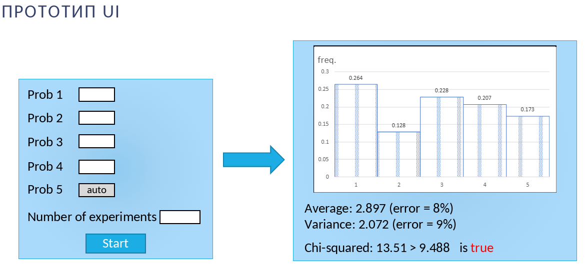
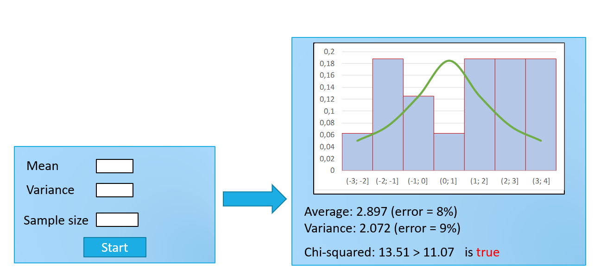
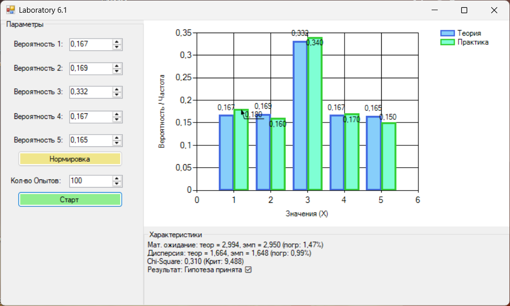
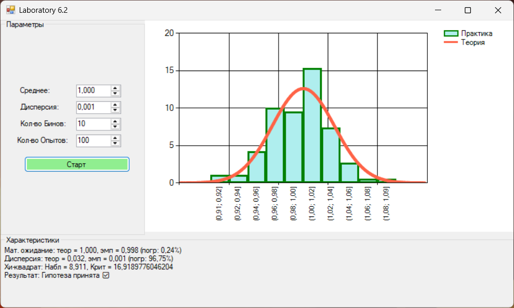

### Имитационное моделирование дискретных случайных величин (GUI)

#### lab06-1
**Задание:**
- Реализовать алгоритм проведения серии экспериментов по генерации дискретной случайной величины, заданной рядом распределения
- Вычислить эмпирические вероятности, выборочные среднее и дисперсию, их относительные погрешности
- Вычислить статистику хи-квадрат и применить критерий хи-квадрат при разных объемах выборки N  (N = 10, 100, 1 000, 10 000)
- Сделать вывод

Пример GUI:

#### lab06-2
**Задание:**
- Выполнить моделирование нормальной случайной величины любым методом. Провести статистическую обработку результатов: 

	- построить гистограмму; 
	
	- оценить точность (относительные погрешности, критерий хи-квадрат) для объемов выборки 10, 100, 1000, 10000;

   	- сделать вывод.
	
Пример GUI:	

=======
- реализовать генерацию дискретной случайной величины, заданной рядом распределения;
	- вычислить эмпирические вероятности;
	- вычислить выборочные среднее и дисперсию, их относительные погрешности;
	- вычислить статистику χ² и применить критерий χ² при:
	  - N = 10, 100, 1 000, 10 000;
- Реализовать генератор нормальной случайной величины, 
	- построить гистограммы 
	- сравнить точность моделирования при разных объёмах выборки.
- сделать вывод.

**Реализация**
- Для дискретной величины реализован комулятивный метод интервалов.
- Для нормальной величины применено преобразование на основе Бокса-Мюллера.
- Для обеих моделей вычисляются выборочные характеристики и статистика хи-квадрат; результаты выводятся в интерфейсе.

- *Лабораторная 6.1*
- Был реализована программа с графическим Интерфейсом:

- 

| Объем выборки ($N$) | $\chi^2$ набл. | $\chi^2$ крит. ($\alpha=0.05$) | Результат проверки |
| :--- | :---: | :---: | :--- |
| **10** | 1.962 | 9.488 | Гипотеза принята |
| **100** | 4.494 | 9.488 | Гипотеза принята |
| **1 000** | 1.569 | 9.488 | Гипотеза принята |
| **10 000** | 2.644 | 9.488 | Гипотеза принята |

- *Лабораторная 6.2*
- Был реализована программа с графическим Интерфейсом:

- 

| Объем выборки ($N$) | $\chi^2$ набл. | $\chi^2$ крит. ($\alpha=0.05$) | Результат проверки |
| :--- | :---: | :---: | :--- |
| **10** | 4.458 | 16.918 | Гипотеза принята |
| **100** | 9.891 | 16.918 | Гипотеза принята |
| **1 000** | 12.609 | 16.918 | Гипотеза принята |
| **10 000** | 14.635 | 16.918 | Гипотеза принята |

**Выводы:**
Приложение моделирует дискретные и нормальные случайные величины. При увеличении объёма выборки эмпирические вероятности, среднее и дисперсия стабилизируются и приближаются к теоретическим значениям, что подтверждает адекватность реализованных генераторов и расчётов.
